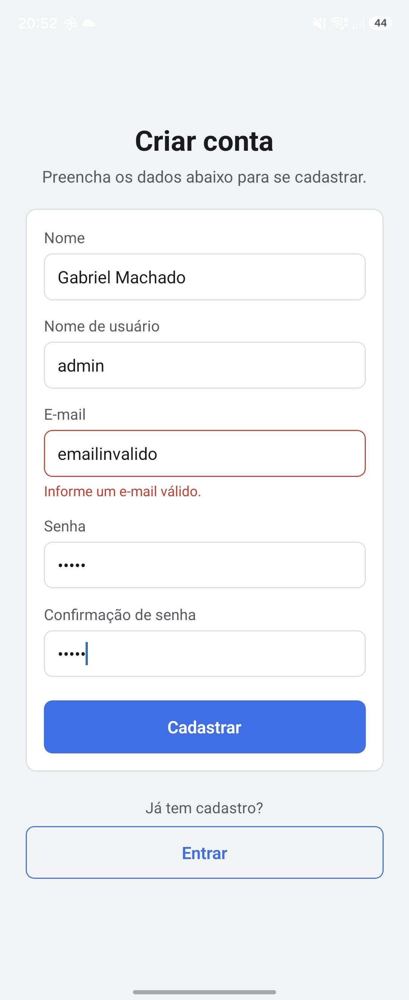
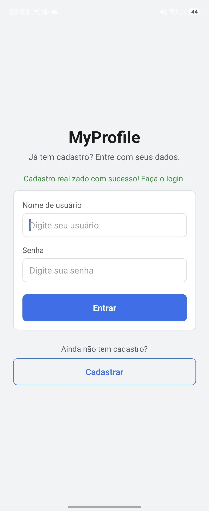
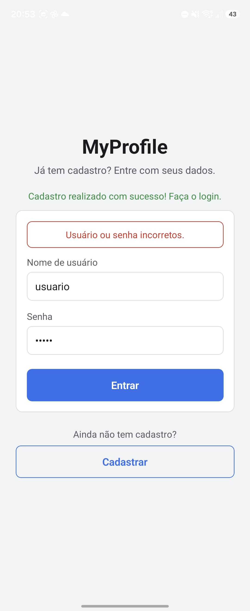
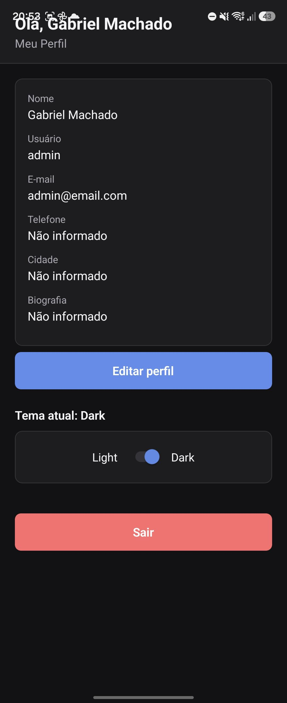
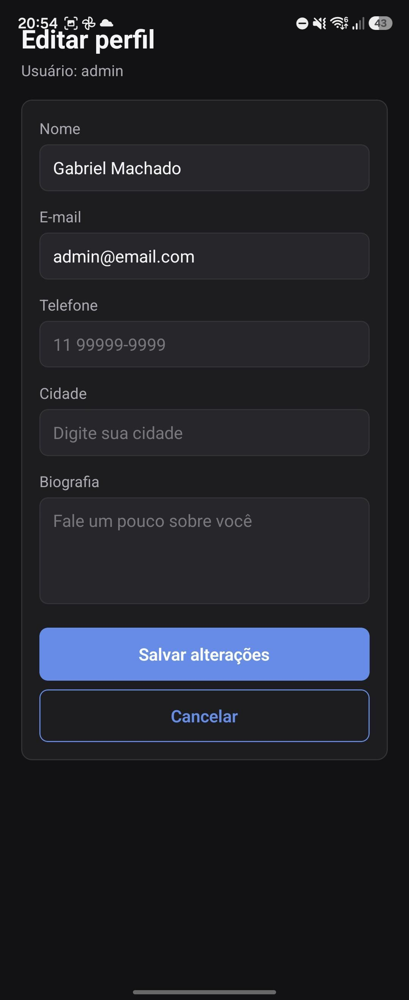
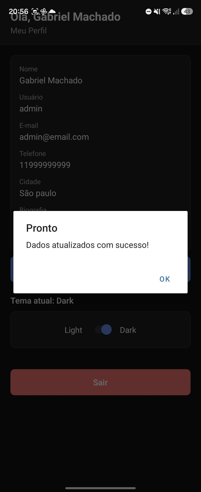
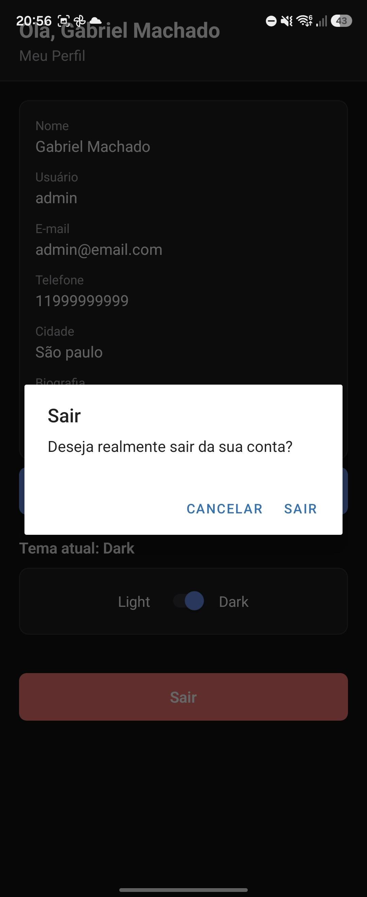

# MyProfile

Aplicativo mobile desenvolvido em React Native com TypeScript e Expo para o CheckPoint 1 da disciplina de Mobile Development & IoT.

O app simula uma área de usuário onde todo o fluxo acontece localmente: cadastro, login, sessão, perfil, edição de dados e troca de tema. Nenhum dado sai do dispositivo — tudo é salvo com AsyncStorage.

## Integrantes

- RM550121 - Gabriel Machado Belardino

## Tecnologias utilizadas

- React Native
- Expo (SDK 54)
- TypeScript
- AsyncStorage (`@react-native-async-storage/async-storage`)
- Context API + Hooks (`useState`, `useEffect`, `useContext`)

## Como executar

```bash
# instalar as dependências
npm install

# iniciar o projeto
npx expo start
```

Depois é só ler o QR Code com o app Expo Go, ou pressionar `a` para abrir no emulador Android e `i` no iOS.

## Funcionalidades implementadas

- Cadastro de usuário com nome, nome de usuário, e-mail, senha e confirmação de senha
- Validação do cadastro (campos obrigatórios, e-mail válido e senhas iguais)
- Cadastro salvo no AsyncStorage
- Login comparando usuário e senha com os dados salvos
- Mensagem de erro quando os dados estão incorretos
- Sessão persistida: ao reabrir o app o usuário continua logado
- Tela de perfil com nome, usuário, e-mail, telefone, cidade e biografia
- Formulário de edição do perfil com validação
- Dados editados persistidos no AsyncStorage
- Temas Light e Dark aplicados em fundo, textos, inputs, botões, cards e headers
- Tema persistido no AsyncStorage
- Logout removendo apenas a sessão (o cadastro continua salvo)
- Loading nas operações (leitura inicial, cadastro, login e salvamento)
- Tratamento de erros nas operações de armazenamento

## Estrutura do projeto

```text
src/
├─ components/
 |      ├─ CustomButton.tsx
 |      ├─ CustomInput.tsx
 |      ├─ ErrorMessage.tsx
 |      ├─ Loading.tsx
 |      ├─ ProfileCard.tsx
 |      └─ ThemeSwitch.tsx
├─ constants/
 |      └─ storage.ts
├─ hooks/
 |      ├─ useAuth.tsx
 |      └─ useTheme.tsx
├─ routes/
 |      └─ Routes.tsx
├─ screens/
 |      ├─ LoginScreen.tsx
 |      ├─ RegisterScreen.tsx
 |      ├─ ProfileScreen.tsx
 |      └─ EditProfileScreen.tsx
├─ services/
 |      ├─ authService.ts
 |      └─ storageService.ts
├─ themes/
 |      ├─ light.ts
 |      └─ dark.ts
├─ types/
 |     ├─ auth.ts
 |     ├─ theme.ts
 |     └─ user.ts
└─ utils/
       └─ validation.ts
```

## Chaves usadas no AsyncStorage

```ts
const USER_STORAGE_KEY = '@myprofile:user';
const SESSION_STORAGE_KEY = '@myprofile:session';
const THEME_STORAGE_KEY = '@myprofile:theme';
```

## Prints da aplicação

### Cadastro



### Login


### Login Invalido


### Perfil Light
[Perfil Light](./prints/PerfilLight.jpeg)

### Perfil Dark


### Editar perfil




### Logout


